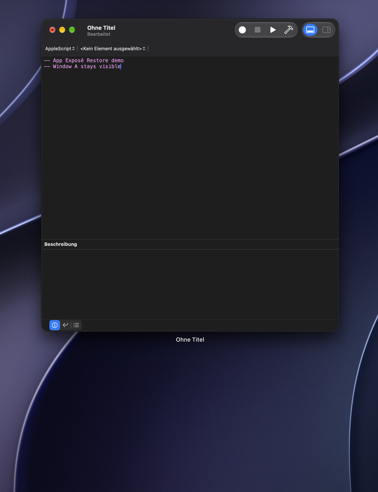
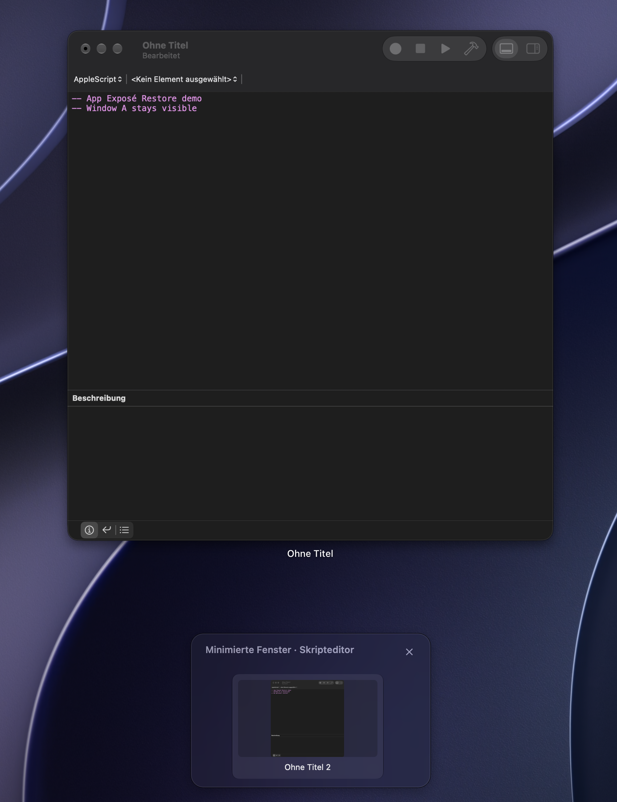
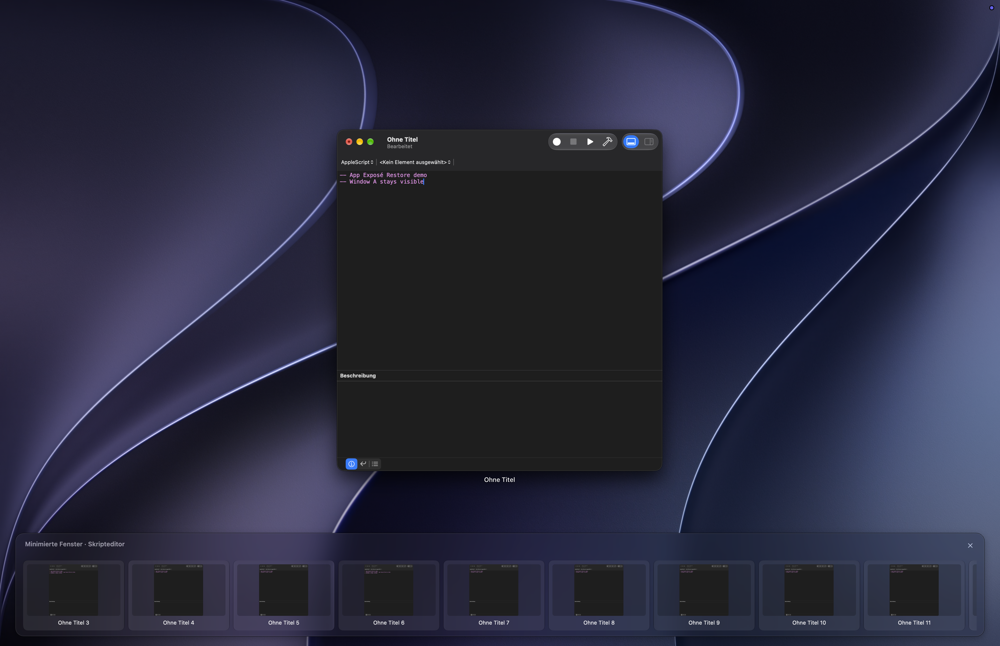

# App Exposé Restore

App Exposé Restore brings minimized windows back into **App Exposé** on macOS 27. Open App Exposé with your existing Control–Down Arrow shortcut or trackpad gesture, then click a card to restore a minimized window. Cards can show a still preview of the window's contents. Finder windows are supported.

This is an independent workaround for the missing minimized-window row in macOS 27. It does not modify macOS or replace your App Exposé shortcut. Detection relies on undocumented Dock and WindowManager window layers, so a macOS update may require an app update.

## Screenshots

These are real macOS 27 App Exposé captures with neutral Script Editor windows. The same window is minimized in both comparison images; only the app's automatic display setting changes. The images were cropped to exclude the second display and empty borders.

| Automatic display off | Automatic display on |
| --- | --- |
|  |  |

With several minimized demo windows, the row expands and scrolls horizontally:



## Build it yourself

Supported on macOS 27. Building requires a full installation of Xcode 27 or later. There are no external packages, services, or build accounts.

```sh
git clone https://github.com/moritzlg/AppExposeRestore.git
cd AppExposeRestore
./test.sh
./build.sh
```

`build.sh` creates `../AppExposeRestore.zip`, outside the repository. Open the ZIP, move `AppExposeRestore.app` to your Applications folder, and launch it. On first use, grant the macOS permissions described below. To update the app, quit it and replace the old app bundle with the newly built one.

The default build uses **ad hoc code signing**. You do not need an Apple Developer account or a certificate to build from source on your own Mac. If you build frequently, you can optionally use your own local code-signing identity so macOS is less likely to ask for permissions again after each build:

```sh
APP_EXPOSE_SIGNING_IDENTITY="Your local code-signing identity" ./build.sh
```

Keep its private key in your own Keychain; never commit or share it. This repository distributes **source code only**. Downloadable binaries would need a separate [Developer ID signing and notarization](https://developer.apple.com/developer-id/) process for normal Gatekeeper handling. The Git history starts with the 0.4.0 source release after private development; it does not claim to include every earlier development step.

## Permissions

| Permission | Why it is needed |
| --- | --- |
| Accessibility | Find minimized windows and restore the selected window. |
| Screen Recording | Show a still image of a minimized window in its card. This is optional; cards show the app icon when permission or an unambiguous image is unavailable. |

The app links to the relevant macOS settings. Its source contains no network requests, analytics, or external dependencies. Window titles and preview images are used in memory and are not saved or transmitted by the app. Only preferences are persisted through macOS `UserDefaults`; diagnostic logs contain timing phases, counts, dimensions, and error codes, without titles or images. This is a description of the current source, not a network restriction enforced by macOS. Review the source before granting Accessibility and Screen Recording access.

## Controls and languages

The menu and Settings window let you turn automatic display, the menu bar icon, and content previews on or off. With the menu bar icon hidden, the app stays accessible from the Dock. The cards use a fixed Clear Liquid Glass appearance; these settings do not change their glass style.

English and German are included. macOS chooses the language from your preferred app languages.

If you use Thaw and the menu bar icon disappears, open Thaw Settings → Menu Bar Layout. Move **App Exposé Restore** from Hidden or Always Hidden into Visible. Thaw can initially place new status items in Hidden. The app uses a stable status-item name so macOS can persist its visibility preference; Thaw manages the section separately.

## Limitations and testing

- The app is designed and tested for macOS 27. Other versions may expose windows differently.
- Previews are still images, not live streams. If a preview cannot be matched safely to its window, the card keeps the app icon.
- Some apps expose minimized windows through Accessibility children instead of their ordinary window list. Both are checked, but a window hidden from both cannot be shown.
- Changing a local app signature can make macOS ask for Accessibility or Screen Recording permission again.

`./test.sh` checks Exposé detection, window enumeration and preview matching, preferences, rendering, and localization. For a manual check, open two windows in one app, minimize one, open App Exposé, and click the added card. Mission Control should not show the added row.

The app icon is generated from `Tools/GenerateAppIcon.swift`. To regenerate `Resources/AppIcon.icns`, compile the generator with Xcode's Swift compiler, run it with a temporary `.iconset` directory, then convert that directory with `iconutil -c icns`.

## License

MIT — see [LICENSE](LICENSE). App Exposé Restore is not affiliated with Apple.
